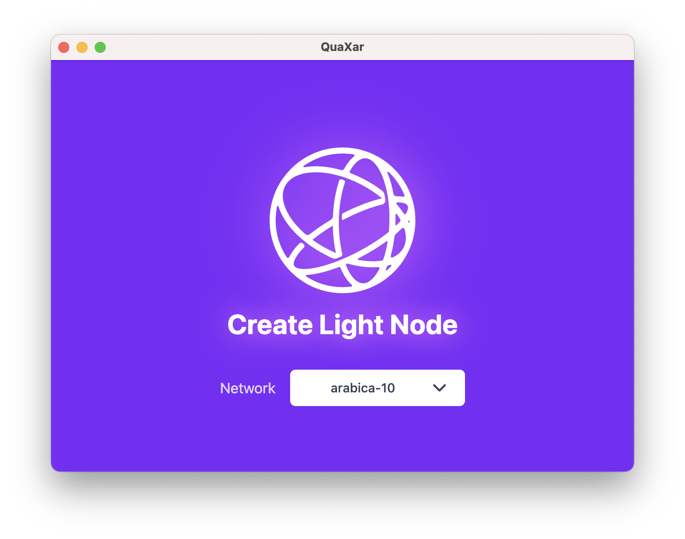
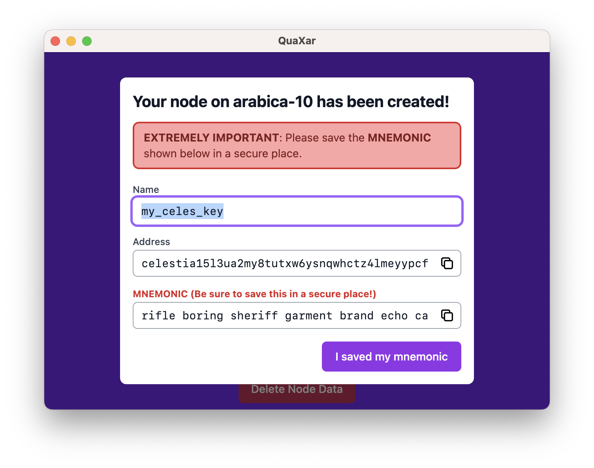
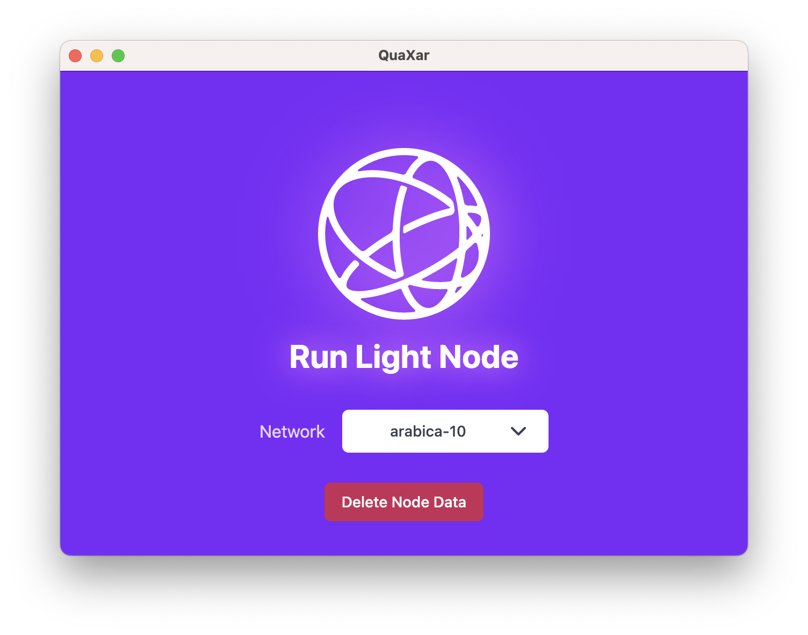
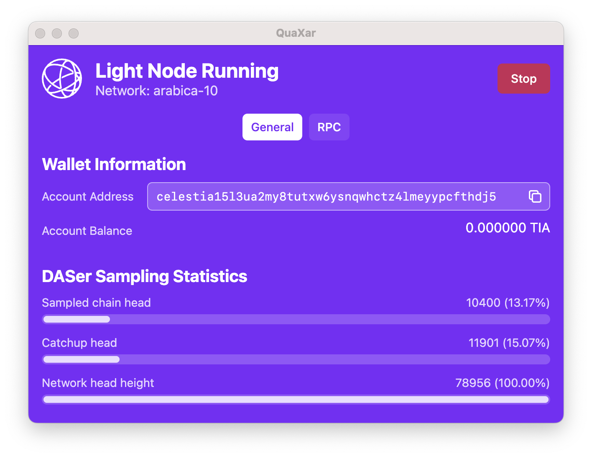
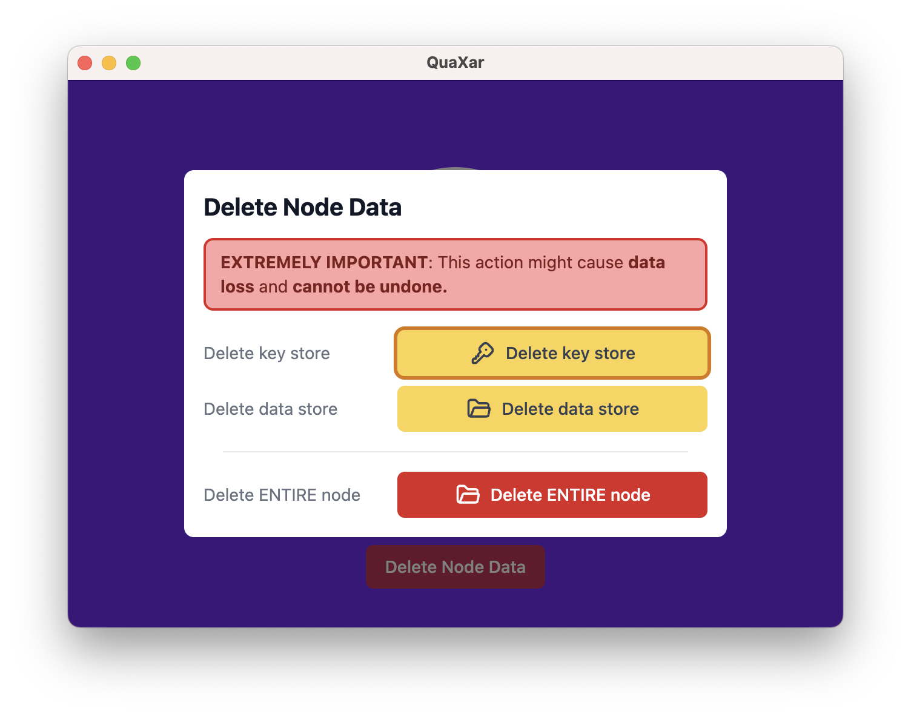
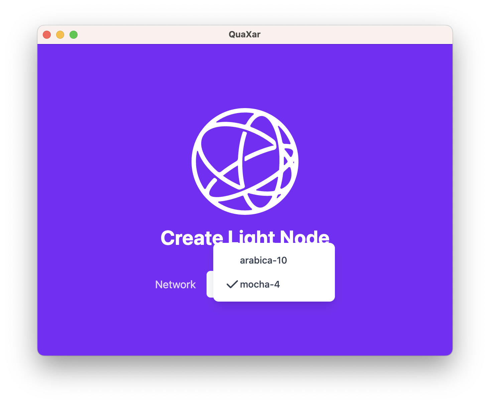
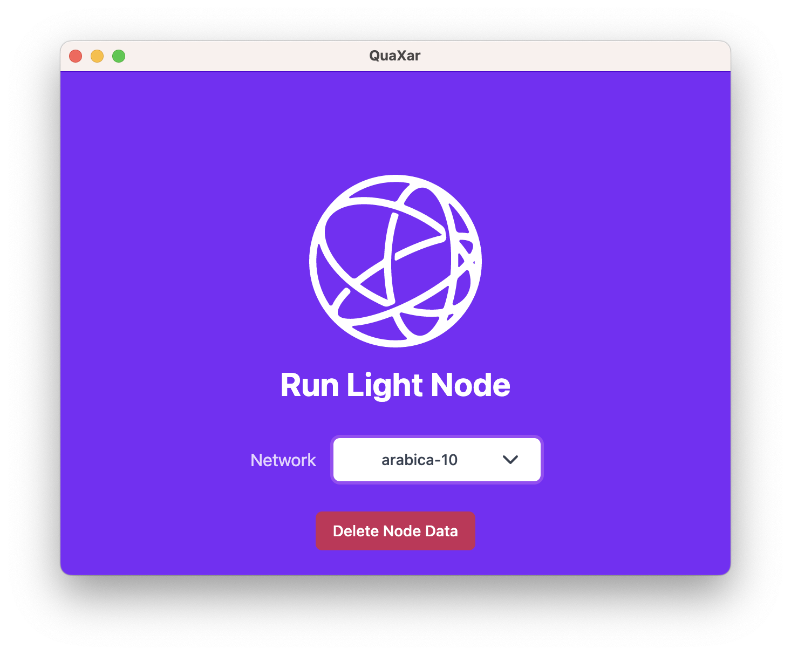
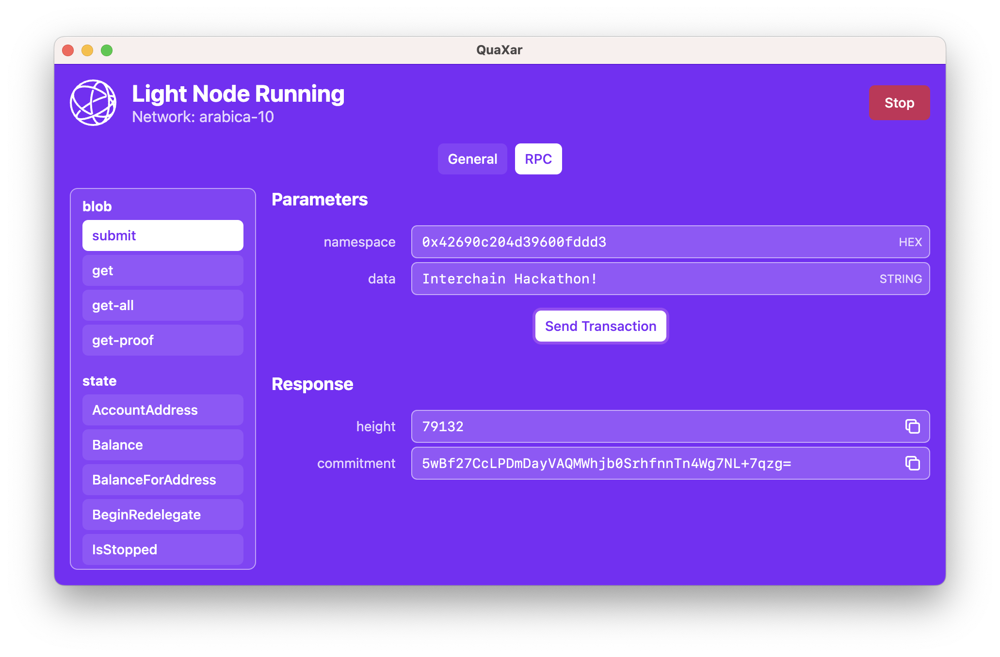
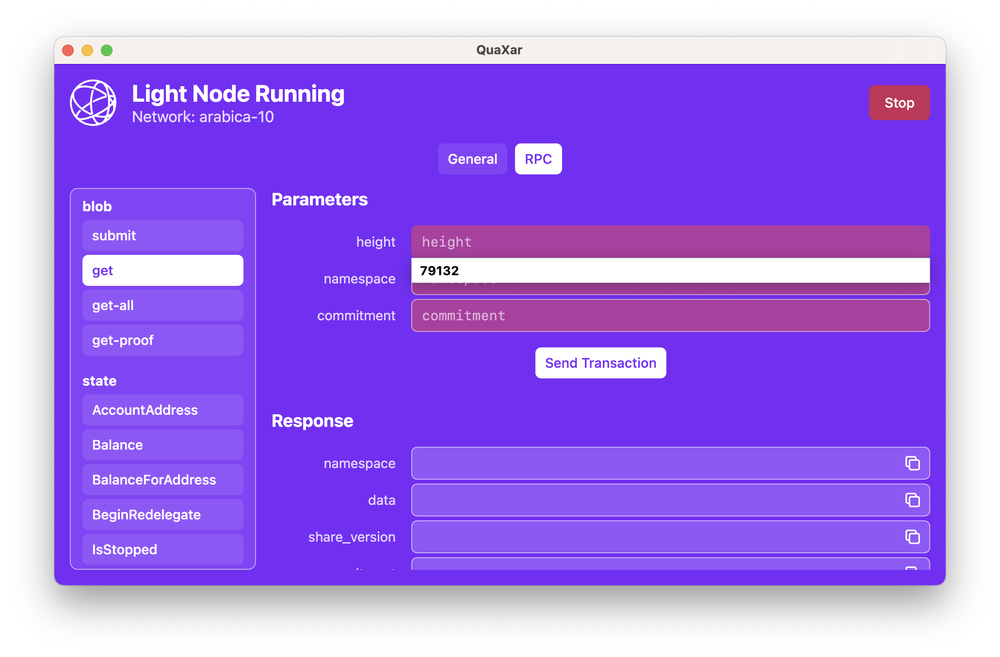

# QuaXar: Cross-Platform GUI for Celestia Light Nodes

## ✨ Key Features

* One-click node creation

  
  

* One-click node execution

  
  

* Node deletion

  

* Network selection

  
  

* RPC transaction from GUI

  

* Copy text button and context-aware auto-completion

  

* Celestia-themed cool design!